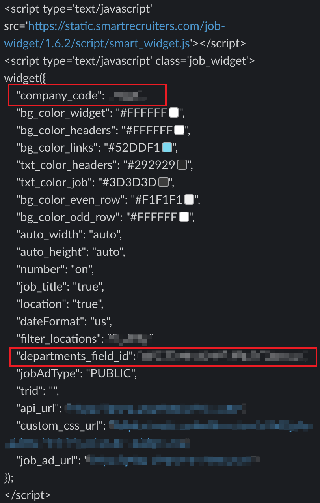

# Smart Recruit Vacancy Widget CSS

> Custom CSS for customizing the smartrecruit Vacancy table styles

- The CSS file that affect the CSS of the widget is the **`widget.css`**
- The rest of the files are for local testing and demo only.

## Local Development

If you just want to change the CSS, simply just edit the `widget.css`

If you want to start a local development and test your CSS, follow below instruction to setup local development.

1. Add a `.env` in the root directory
2. Copy all the content from `.env.example` to `.env`

> Alternatively, can just run the following command in the terminal to complete step 1 to 2.

```console
cat .env.example > .env
```

3. Fill out all the variables base on the widget parameters. Check the sample below.



4. Install all dependencies using `yarn install` in the terminal

5. Simply run `yarn dev` to start local server, any changes to the widget.css will be reflected in the browser.

6. Local server url is at http://localhost:5173/

## Deployment

Simply replace the `custom_css_url` widget parameter with `https://bilue.github.io/smartrecruit-vacancy-css/widget.css`.
